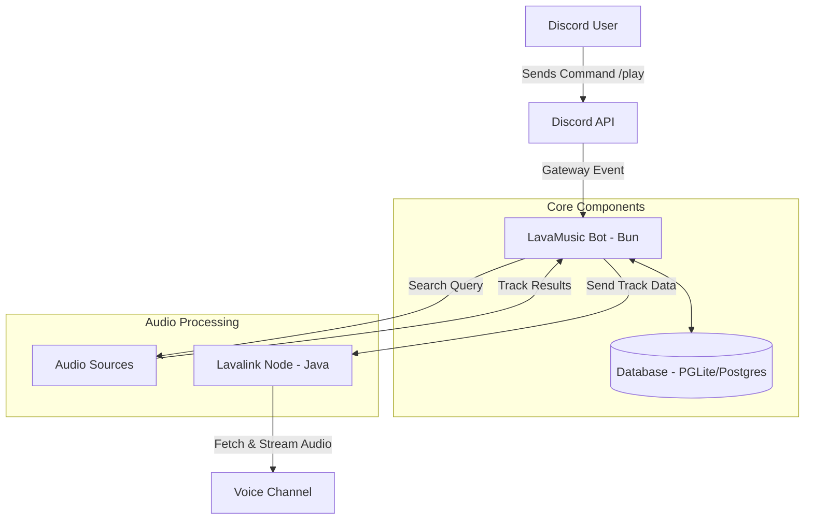

# Architecture & Logic

Understand how LavaMusic processes your requests and delivers high-quality audio to your Discord server.

---

## Technical Overview

LavaMusic is built with a modular architecture that separates the bot logic from the audio processing engine. This ensures stability and high performance even under heavy load.

### How it Works

The following diagram illustrates the flow of a command from a Discord user to the audio output:

---

## Core Components

### 1. LavaMusic Bot (Bun & TypeScript)

This is the "brain" of the project. It handles:

* **Command Parsing**: Understanding what the user wants.
* **Permissions**: Ensuring only authorized users (like DJs) can skip tracks.
* **Internationalization**: Sending messages in the user's preferred language.
* **Database Management**: Saving your custom playlists and server settings.

### 2. Lavalink (Java)

Lavalink is the "muscle" that does the heavy lifting:

* **Audio Streaming**: Connecting to Spotify, YouTube, and SoundCloud.
* **Audio Filters**: Applying effects like Bassboost, Nightcore, and 8D.
* **Persistence**: Keeping the player active even if the bot restarts.

### 3. Database (Drizzle ORM)

We use **PGLite** or **PostgreSQL** to store:

* **Custom Playlists**: Your saved songs.
* **Server Config**: Custom prefixes and DJ roles.
* **24/7 Mode**: Remembering which channels the bot should stay in.

---

## Interaction Flow

1. **User Input**: A user types `/play "LavaMusic Theme"`.
2. **Search**: The bot searches for the track and retrieves metadata (title, URL, duration).
3. **Database Check**: The bot checks the server's DJ settings and volume preferences.
4. **Audio Request**: The bot tells Lavalink to connect to the user's voice channel and start streaming the audio.
5. **Playback**: Lavalink streams the audio directly to Discord's voice servers with minimal latency.

::: tip PERFORMANCE NOTE
Since LavaMusic is built with **Bun**, command processing is near-instant, providing a much smoother experience than traditional Node.js bots.
:::

---

::: info WANT TO LEARN MORE?
Check out our [Installation Guide](/installation) to start hosting your own instance!
:::
